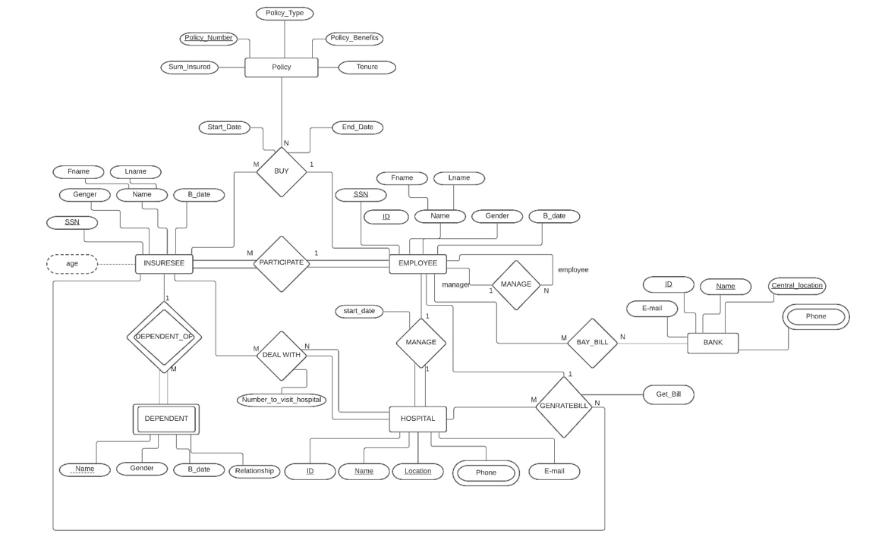
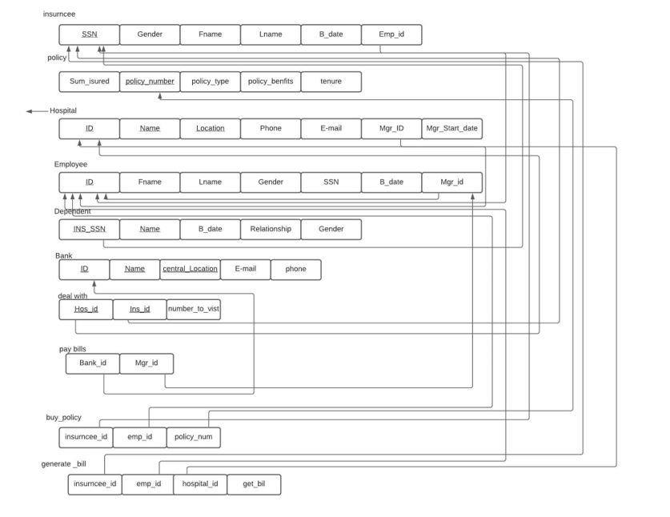

# Health Insurance System

**Health Insurance System** is a desktop application developed using C# and Oracle database, designed to facilitate the management of health insurance policies. The system allows employees to add insurancees to the database, insurancees to purchase policies, managers to handle hospitals, and payments to be processed through a bank. The goal is to streamline the process of managing health insurance policies and provide a reliable system for all stakeholders involved.

## Main Entities

**Insurancee**: The Insurancee entity represents individuals who hold health insurance policies. They can avail various functionalities within the system, such as purchasing policies, selecting hospitals for treatment, and managing their policy details.

**Policy**: The Policy entity refers to the different types of health insurance policies available. It encompasses the details and coverage options provided to Insurancees. The policies are stored in the Oracle database and can be accessed and managed through the system.

**Employee**: The Employee entity represents individuals who are responsible for managing the Health Insurance System. They have the authority to add insurancees to the Oracle database and handle various administrative tasks related to the system's functionality.

**Dependent**: The Dependent entity relates to the dependents of Insurancees. It provides information on whether an Insurancee has dependents or not. This data is stored in the Oracle database and can be associated with the respective Insurancee.

**Bank**: The Bank entity represents the financial institution involved in the Health Insurance System. It handles the payment transactions for Insurancees and manages the billing process. The payment details and transaction records are stored securely in the Oracle database.

## Relationships

The Health Insurance System makes use of relationships between entities to ensure smooth data flow and efficient management. Here are the key relationships in the system:

- **Employee - Insurancee**: This relationship signifies that an Employee adds an Insurancee to the system and manages their insurance-related information stored in the Oracle database.
- **Employee - Hospital**: The relationship between Employee and Hospital indicates that the Employee handles hospitals within the system. This includes managing hospital information, such as contact details and preferred hospitals for Insurancees.
- **Insurancee - Hospital**: This relationship allows Insurancees to choose a specific hospital for their treatment within the system. The hospital preferences are stored in the Oracle database and can be updated as per the Insurancee's requirements.
- **Insurancee - Dependent**: The relationship between Insurancee and Dependent determines whether an Insurancee has dependents or not. This information is stored in the Oracle database and can be associated with the respective Insurancee.
- **Employee - Employee**: This relationship helps determine whether an Employee has a manager or not. It allows for a hierarchical structure within the system, enabling efficient management and supervision.
- **Hospital - Insurancee - Employee**: This relationship enables the generation of bills for each Insurancee, connecting Hospitals, Insurancees, and Employees. The billing information is securely stored in the Oracle database and can be accessed and processed for payment transactions.
- **Employee - Policy - Insurancee**: The relationship among Employee, Policy, and Insurancee allows Insurancees to purchase policies through the system. The policy details are stored in the Oracle database and can be associated with the respective Insurancee.

## Entity Relationship Diagram (ERD) and Schema

This project includes an Entity Relationship Diagram (ERD) that visually represents the entities, their attributes, and the relationships between them. The ERD provides a clear overview of the database structure and the connections between different components of the Health Insurance System.

Additionally, the project provides a database schema that outlines the tables, columns, and constraints used in the Oracle database. The schema defines the structure of the database, ensuring the integrity and organization of the data.

